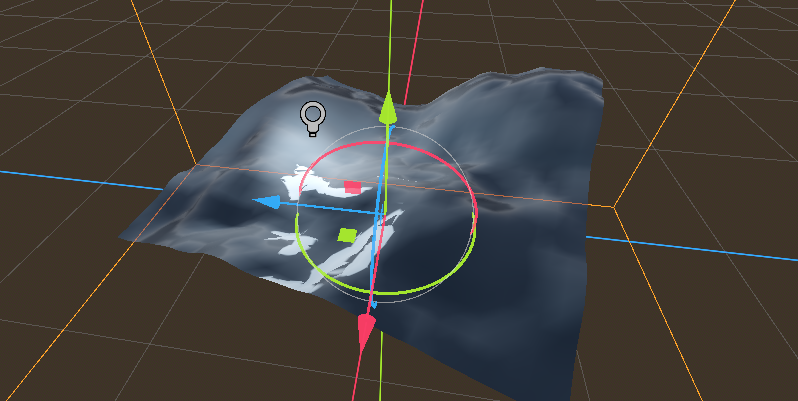
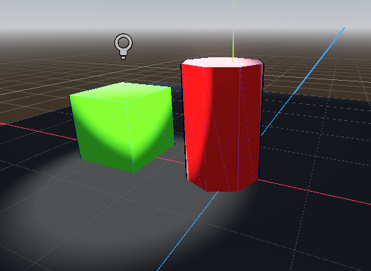

# Assignment 4 - Shaders
> *By George Padron*

This project contains four folders containing scenes each demonstrating a different shader. The `first-shader`, `second-shader`, and `compute-shader` folders contain the shaders used in their respective Godot Tutorials, while `cel-shader` contains self-made vertex and fragment shaders. 

# How to setup
Simply clone this repository and open it as a project in the latest version of Godot. 
# First Shader
[./first-shader.png]

The first shader is an example of a *vertex* shader, which transforms how the vertices on the mesh are rendered. In this case, the vertices are transformed using a noise map to create a simplistic terrain simulation. Then a normal map is rendered over the vertices to give the terrain more depth and have it respond more realistically to light. 
# Second Shader

This shader features a realistic simulation of water. The toon render mode is used to reflect the simplistic and dull way that water reflects light. Once again, a noise map is used in the generation of this image. However, the wave's position is controlled and animated by a sin wave function. This function is applied multiple times to the vertices in order to make the water's waves appear realistic and imperfect. Finally, some additional parameters are applied to the texture of the water in order to make the water appear more "water-like". 

# Compute Shader

This shader does not render any graphics. Instead, we use the graphics shader in order to transform a list of numbers. We load the shader into GDScript and pass it in an array of numbers, and get the result of each number in that array doubled. This demonstrates how shader language can be used to run complex calculations in parallel using the GPU. 

# Cel Shader

This custom shader has two elements: a fragment shader which alters the lighting of objects to give it a more "cartoonish" and simple look, and a vertex shader which renders a simple black outline. Attached to one of the objects in the scene is a gdscript which plays a simple animation - increasing the border and modifying the fresnel effect of the light in a loop to demonstrate how this shader can be modified by using gdscript. 

The main cel shader itself uses a simple gradient and a fresnel effect in order to alter how light is rendered on objects. This smooths out the light, giving objects a simple "lit" and "unlit" look to them as if they were drawn by hand. 

The outline shader simple takes the normals, expands them a bit, and culls the front-facing ones so that only the ones behind the main objects model will appear. 

